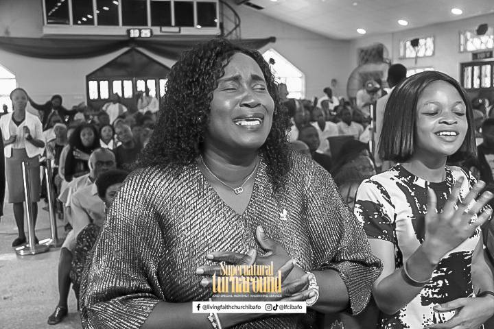

# 🌟 Living Faith Church Ibafo (Winners Chapel) — Modern Web Platform

Welcome to the **official modern digital web platform** for **Living Faith Church Ibafo (Winners Chapel International)** — designed to inspire faith, liberate souls, connect worshippers globally, and showcase the signs and wonders wrought by God’s Word along the Lagos-Ibadan corridor.



---

## ✝️ About the Church & Mandate

> *"The hour has come to liberate the world from all oppressions of the devil through the preaching of the Word of Faith; and I am sending you to undertake this task."*  
> — **Bishop David O. Oyedepo** (Presiding Bishop, Living Faith Church Worldwide)

Under the pastoral leadership of **Pastor Babatunde Olaitan**, Living Faith Church Ibafo serves as a spiritual lighthouse along the Lagos-Ibadan expressway, raising giants, healing the brokenhearted, and transforming destinies.

---

## 🚀 Key Features & Digital Capabilities

### 🎨 1. Modern Glassmorphic Design & Theme Switcher
- Curated **Winners Crimson Red (`#8B0000`)** and **Divine Gold (`#D4AF37`)** theme.
- **Dark Mode & Light Mode** toggle with instant local storage persistence.
- Fluid responsive layout optimized for smartphones, tablets, laptops, and ultra-wide displays.
- Smooth CSS micro-animations, glassmorphism blur headers, and interactive card lift effects.

### 🔍 2. Global Spotlight Quick Search (`Ctrl + K` / `⌘K`)
- Interactive Command Palette providing instant search across services, bus routes, scriptures, cell centers, giving info, and ministries.
- Keyboard accessible navigation with `<kbd>` shortcuts and quick-filter category pills.

### 📖 3. Daily Devotional & Prophetic Word of the Day
- Daily scripture reading, revelational exposition, and prophetic declaration.
- Multi-day archive with Next/Previous/Today date navigators.
- **1-Click "Copy Declaration"** and direct **"Share to WhatsApp Status"** formatting.
- **"Draw Faith Card"** generator with celebratory confetti animation.

### 🛡️ 4. Covenant Scripture Vault & Promise Finder
- Searchable database of faith scriptures categorized by:
  - *Divine Healing*
  - *Financial Fortune*
  - *Protection & Safety*
  - *Fruit of the Womb*
  - *Career & Academics*
  - *Peace & Freedom*
- 1-Click Copy Verse cards with instant toast feedback.

### ⏱️ 5. Dynamic Live Service Countdown
- Real-time digital countdown clock calculating time remaining until the next upcoming service (Sunday 1st, 2nd, 3rd Celebration services, Wednesday Midweek Communion, WSF, or Covenant Hour of Prayer).
- Live topbar announcement ticker with active prophetic focus.

### 📅 6. Church Events, Prophetic Focus & Calendar Sync
- Monthly Prophetic Theme showcase (*Month of Wonders Without Number*).
- Upcoming events timeline (Week of Spiritual Emphasis, WOFBI Leadership Courses, Youth Alive Summit, Prophetic Breakthrough Services).
- **"Add to Calendar"** with automatic `.ics` download and Google Calendar support.
- **"Set Event Reminder"** modal with SMS/WhatsApp alert scheduling.

### 🏠 7. Winners Satellite Fellowship (WSF) Home Cell Locator
- Interactive directory of WSF Home Cell Centers across **Ibafo Central**, **Gideon Village**, **Asese**, **Mowe**, **Magboro**, and **Orimerunmu**.
- Filter by area, search by street/host, and direct WhatsApp connect / Google Maps directions.

### 🎧 8. Sermons & Podcast Center with Web Speech Voice Reader
- Interactive sermon archive with topic and speaker filters (**Faith & Power**, **Prayer & Deliverance**, **Divine Health**, **Financial Fortune**, **Praise & Wonders**).
- **Sticky Floating Audio Player** bar with play/pause, scrubbable progress bar, dynamic timers, next/prev tracks, and playback speed control (0.75x, 1x, 1.25x, 1.5x, 2x).
- **AI Voice Reader (Web Speech API)**: Recites sermon summaries and outlines aloud in clear spoken voice.
- Printable sermon notes and scripture study guides.

### 💳 9. Online Giving & Interactive Tithe Calculator
- Real-time **10% Tithe & Offering Calculator** with copy-ready summary.
- Transparent bank accounts for **Tithe & Offering** (Zenith Bank), **Church Project** (Access Bank), **Welfare & Shiloh** (GTBank), and **Diaspora Domiciliary USD/GBP** accounts.
- Quick USSD code dialers (`*966#`, `*737#`, `*901#`).
- **1-Click Copy Account Number** with animated celebratory toast notifications.

### 🪜 10. Spiritual Growth Track & New Convert Pathway
- 4-Step Discipleship Pathway:
  1. *Salvation & New Creation* (with Salvation Prayer modal & decision form)
  2. *Water & Holy Ghost Baptism* (Online baptism registration)
  3. *Believer's Foundation Class (BFC)*
  4. *WOFBI & Kingdom Stewardship*

### 📺 11. Live Stream Hub & Interactive Watch Party
- Embedded DOMI YouTube Live stream player.
- Interactive Watch Party with live online worshipper counter.
- Floating animated praise reactions (**🔥 Amen**, **🙌 Glory**, **❤️ Hallelujah**, **⚡ Power**).

### 🏛️ 12. 12 Pillars of Faith & Ministries Showcase
- Detailed breakdown of the 12 Biblical Pillars of the Commission.
- Comprehensive ministry units: **Youth Alive Fellowship (YAF)**, **Kingdom Heritage (Children)**, **Teens Alive**, **Winners Voice Choir**, **Sanctuary Keepers & Ushers**, **Technical/Media**, **WOFBI Leadership Institute**, and **Medical/Community Outreach**.
- Interactive **"Join a Service Unit"** modal registration application.

### 🌟 13. Testimonies & Turnaround Portal
- Documented proofs of God’s power (Supernatural Healings, Career Breakthroughs, Miracle Babies, Financial Turnarounds).
- Interactive **"Share Your Testimony"** modal for worshippers to submit their praise reports.

### 🗺️ 14. First-Time Visitor Guide & Free Bus Route Map
- **"Plan Your Visit"** step-by-step booking form with automatic reservation for VIP pastoral welcome.
- Comprehensive **"What to Expect"** FAQ accordion.
- Free Sunday church bus pickup routes across **Ibafo Express**, **Asese Bridge**, **Mowe**, **Magboro**, **Gideon Village**, and **Orimerunmu**.

### 📸 15. Deluxe Photo Gallery & Lightbox
- 22+ high-resolution church photographs categorized into:
  - *Worship & Sanctuary*
  - *Youth & Teens*
  - *Holy Ordinances (Communion & Washing of Feet)*
  - *Leadership & WOFBI*
  - *Choir & Live Praise*
- Fullscreen deluxe lightbox with Next/Previous buttons, keyboard arrows (`←` / `→` / `Esc`), touch swipe gestures, and download support.

### 💬 16. 24/7 Prayer Request & Floating Hotlines
- Confidential online prayer request submission form.
- Floating Speed Dial with instant WhatsApp pastoral helpline, search shortcut, giving shortcut, and back-to-top button.

---

## 🛠️ Technology Stack

| Category | Tools / Technologies |
|---|---|
| **Structure** | Semantic HTML5, Schema.org Markup, OpenGraph Tags |
| **Styling** | Vanilla CSS3 (Custom Properties / CSS Variables, Glassmorphism, CSS Grid, Flexbox) |
| **Logic & Interactivity** | Vanilla JavaScript (ES6+, Web Speech API, IntersectionObserver, Clipboard API, iCal Generator) |
| **Typography** | Google Fonts (*Plus Jakarta Sans*, *Outfit*, *Playfair Display*) |
| **Icons** | Font Awesome 6.5 |

---

## 📂 Project Architecture

```
Living-faith-church-ibafo/
│
├── index.html          # Semantic HTML5 structure, schema markup & modals
├── style.css           # Modern CSS design system (Light/Dark themes, glassmorphism)
├── script.js           # Stateful JS (Search, Devotional, WSF, Tithe Calc, Audio, Lightbox)
├── README.md           # Project documentation & feature manual
├── banner.jpeg         # Main church auditorium hero banner
├── winners.png         # High-resolution church logo crest
├── winners.jpeg        # Supplementary emblem
│
└── images/             # Real church photographic assets (25 photos)
    ├── altar.jpg       # Sanctuary & Altar
    ├── church.jpg      # Congregation in Sunday worship
    ├── pastor.jpg      # Resident Pastor Babatunde Olaitan
    ├── communion.jpg   # Holy Communion table
    ├── washing of feet.jpg # Ordinances
    ├── dance.jpg       # Youth Alive drama & choreography
    ├── foren.jpg       # Winners Voice Choir
    ├── praise.jpg      # High Praise ministration
    ├── bassist.jpg     # Live instrumentation & bass
    ├── drummer.jpg     # Sound of praise & drums
    ├── graduation.jpg  # WOFBI Graduation ceremony
    ├── graduant.jpg    # WOFBI Graduands
    ├── elder.jpg       # Pastoral team in prayer
    ├── dignitries.jpg  # Special ministers & dignitaries
    ├── teens church.jpg# Teens Alive congregation
    ├── rebot.jpg       # Kingdom Heritage Children Church
    ├── prayer.jpg      # Covenant Hour of Prayer
    ├── oyibo.jpg       # Prophetic impartation
    ├── goody.jpg       # Praise & worship encounter
    ├── testimony.jpg   # Testifier at altar
    ├── tithe.jpg       # Covenant thanksgiving
    ├── worker.jpg      # Sanctuary hospitality workers
    ├── front view.jpg  # Church front entrance
    ├── genarator.jpg   # Sanctuary facilities
    └── banner.jpg      # Thanksgiving banner
```

---

## ⚡ Setup & Local Preview

1. **Clone the repository:**
   ```bash
   git clone https://github.com/Goody24/Living-faith-church-ibafo.git
   ```

2. **Open in any modern web browser:**
   - Double click `index.html` or open via standard HTTP server:
   ```bash
   python3 -m http.server 8000
   ```
   - Navigate to `http://localhost:8000`

---

## 📍 Church Coordinates

- **Sanctuary Location:** Lagos-Ibadan Expressway, Gideon Village, Ibafo, Ogun State, Nigeria.
- **Service Times:**
  - **Sunday 1st Service:** 6:30 AM - 8:15 AM
  - **Sunday 2nd Service:** 8:30 AM - 10:15 AM
  - **Sunday 3rd Service:** 10:30 AM - 12:15 PM
  - **Wednesday Midweek Communion:** 6:00 PM - 7:45 PM
  - **WSF Home Cells:** Saturdays 5:00 PM - 6:00 PM
  - **Covenant Hour of Prayer:** 6:00 AM (Mon - Sat)

---

## 📜 Scriptural Foundation

> *“For whatsoever is born of God overcometh the world: and this is the victory that overcometh the world, even our faith.”*  
> — **1 John 5:4**
